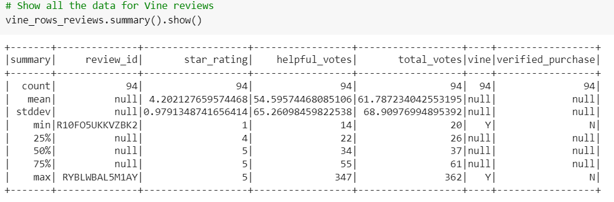
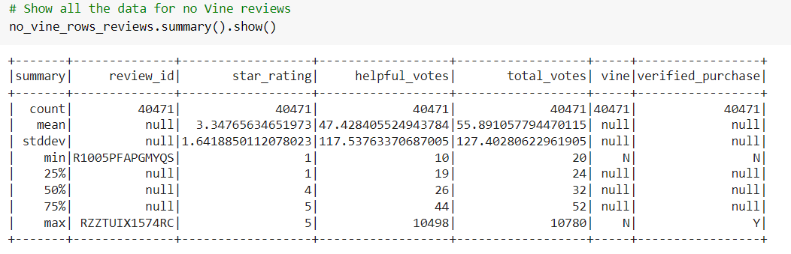
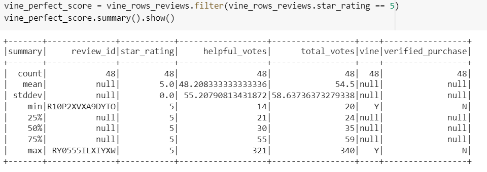
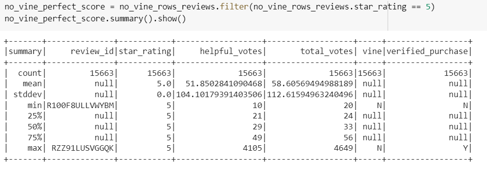

# Amazon_Vine_Analysis

The purpose of this project was for me to perform an analysis on Amazon reviews for video games! This project was done by using PySpark, SQL, Google Colab, Amazon AWS, and pgAdmin. I wanted to find out how well video game products performed on reviews.

## Results:

# Total Vine Reviews

Under summary and in the count row, we can see that there are 94 Vine reviews for video games.

# Total Non-Vine Reviews

Under summary and in the count row, we can see that there are 40,471 non-Vine reviews for video games. That's significantly larger than the dataset for Vine reviews!

# Number of Five Star Vine Reviews

Under summary and in the count row, we can see that there are 48 five star Vine reviews for video games.

# Number of Five Star non-Vine Reviews

Under summary and in the count row, we can see that there are 15,663 five star non-Vine reviews for video games.

# Percentage of Five Star Vine Reviews

Since we know that there are in total 94 Vine reviews and 48 of them are five stars, we can deduce that the overall percentage of five star Vine reviews is 51%.

# Percentage of Five Star non-Vine Reviews

Since we know that there are in total 40,471 Vine reviews and 15,663 of them are five stars, we can deduce that the overall percentage of five star non-Vine reviews is 39%.

## Summary:

Is there any positivity bias for reviews in the Vine program? I'm inclined to say that technically there is a bias for Vine reviews. 51% for five stars is significantly larger than the 39% for five stars for non-Vine reviews. However, the dataset for Vine reviews is incredibly smaller compared to the dataset for non-Vine reviews. Realistically, the gap between the two datasets is too large to truthfully say that we can use this analysis to prove that there is a positivity bias.

To further this analysis, I would want to dive deeper and have the tables include the product_id. That way I can break it down to each product and see if there is a percentage variance between each product and Vine and non-Vine reviews.